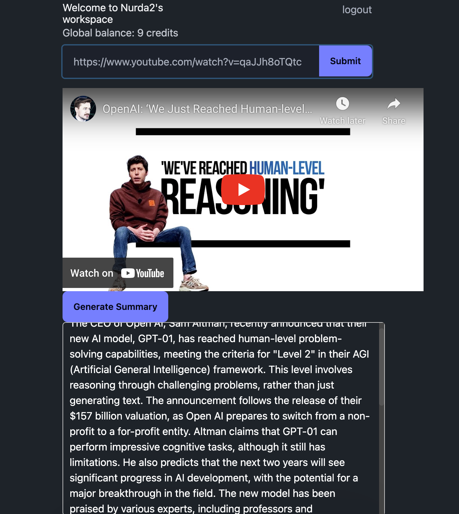
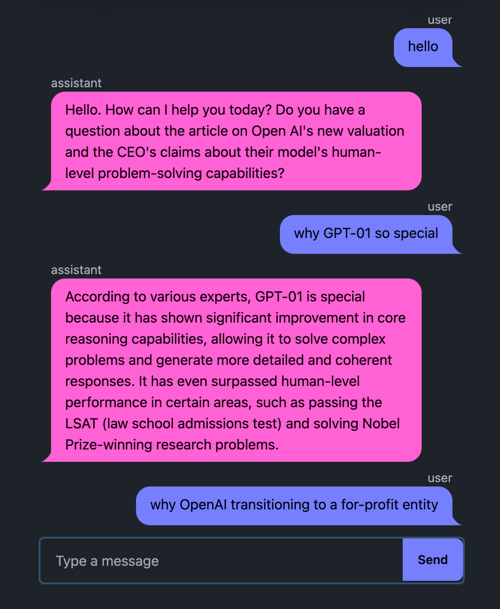
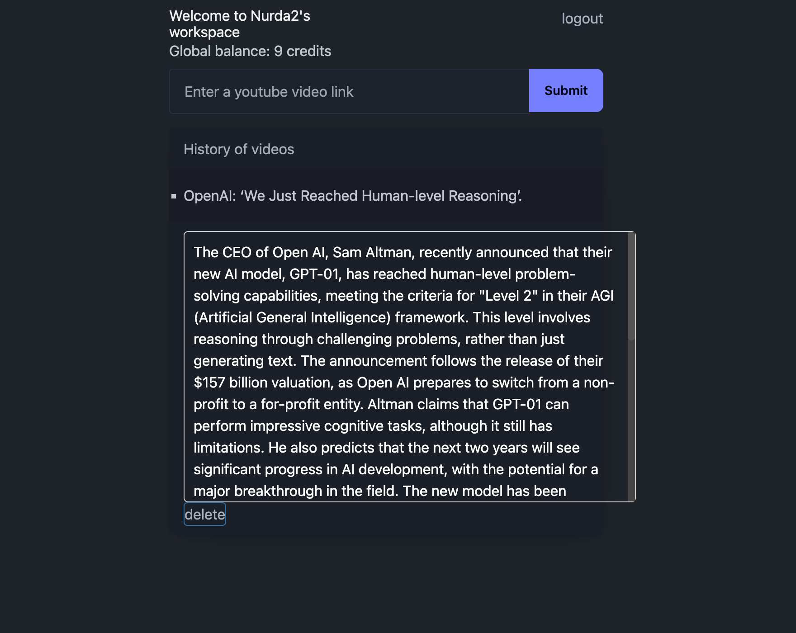
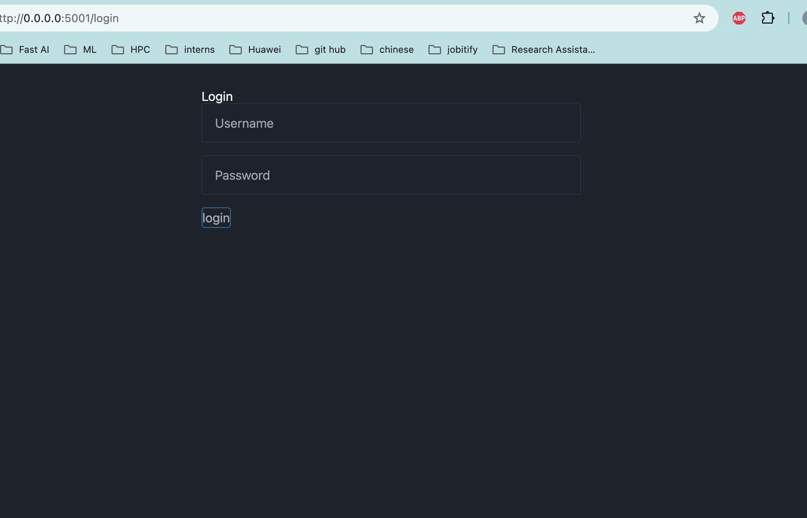

<div align="center">
    <h1>VideoInsight</h1>
</div>

## YouTube Transcript Summarizer

VideoInsight is a web application designed to extract, summarize, and analyze transcripts from YouTube videos. By leveraging LLama3 and Retrieval-Augmented Generation (RAG), VideoInsight offers users concise summaries and insightful answers based on video content. It is built using FastHTML, a Python framework that enables rapid development of web applications in a single Python file.

Features
* User Login Authorization: Secure access for personalized user experiences.
* SQLite Database: Stores history of summaries for easy retrieval.
* RAG-Based Chatbot: Provides intelligent, context-aware interactions.

## Screenshots






## Run Locally

Clone the project

```bash
  git clone https://github.com/NurNazaR/VideoInsight.git
```

Go to the project directory

```bash
  cd VideoInsight
```

Install dependencies

```bash
  pip install -r requirements.txt
```

Create .env file and put api keys inside the .env
- https://www.together.ai/
- https://www.mongodb.com/ 
```bash
  TOGETHER_API_KEY=your_api_key_here
  MONGODB_URL=your_mongodb_uri_here
```

Run main.py file and web app will be hosted in local 5001 port
```bash
  python main.py
```
Open the browser and put below url

```bash
  http://localhost:5001/login
```
## Acknowledgements
 - [FastHTML documentation](https://docs.fastht.ml/)
 - [FastHTML example repos](https://github.com/AnswerDotAI/fasthtml/tree/main/examples)
